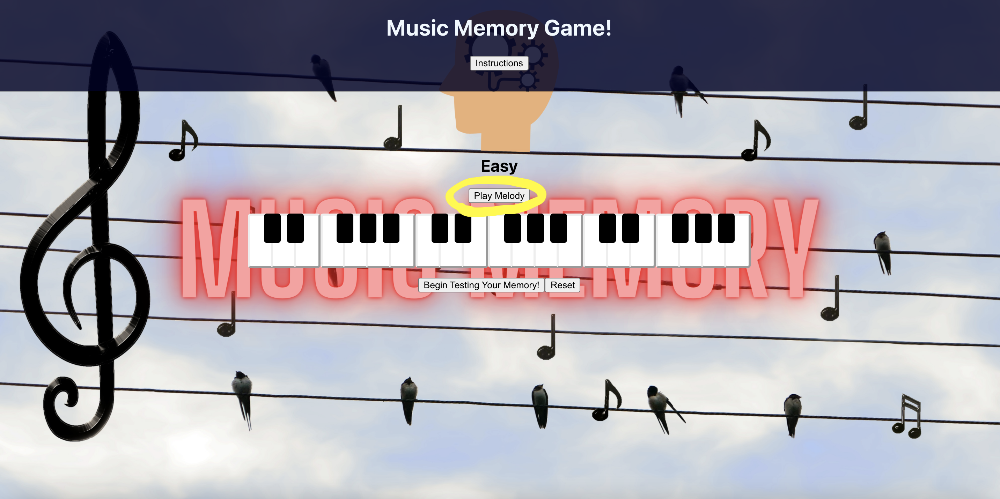
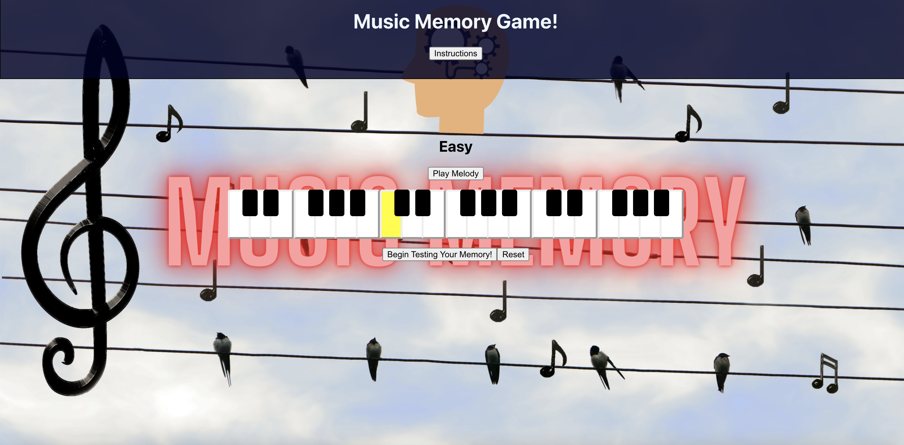
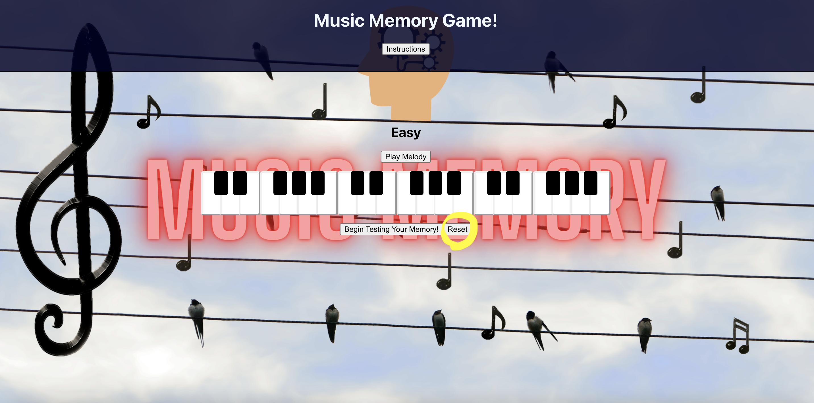
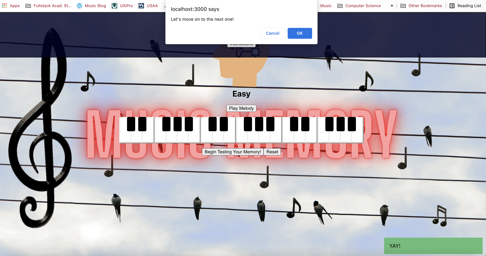

# MusicMemoryGame

## Description:

My goal was to make a game that tests the user's ability to strengthen their tonal and visual memory.

## About

**deployed link:** https://music-memory-game.herokuapp.com/

### **Created by:**

Joe Young

**Portfolio:** https://www.josephmyoung.com

**LinkedIn:** https://www.linkedin.com/in/joseph-m-young

**Built**: During a Mintbean Hackathon

**Duration of Creation:** 1 week

## How to Play:

To first hear (and see) the melody you'll need to try and remember, press "Play Melody." You can play it as many times as you wish.

(Then the melody will play!)

Do your best to remember the melody and when you're ready, press "Begin Testing Your Memory!"

From there, begin to play (by clicking) the melody on the piano. You be alerted if you play a wrong note.
\*\*The game is tracking each note you click, so if you want to "wipe the slate clean" and start over, you can click "Reset" and then click "Begin Testing Your Memory" again to resume playing.

Once you play the melody correctly, good job: try a more difficult melody!

\*\*Rhythm does not matter. If a melody has rhythm(s) in it when you listen to it, you do not need to replicate that rhythm to get the correct answer. You only need to playback the correct notes in correct order.

## **Technologies Used:**

- React JS Framework
- Tone.js

## Goals:

Right now there isn't true "win/lose" conditions,but rather "good job/wrong answer" conditions. I plan adding the functionality that keeps track of wrong guesses, apply a limit to them (before the user has to start over), and keep track of how many melodies they got right or wrong.
Visually the user will not be able to view the next level of melodies until successfully completing the prior one. A function will be added that will randomly generate melodies as to not have to manually create them and muddy up the code.
Users will be able to save their progress and resume their progression at any time.
